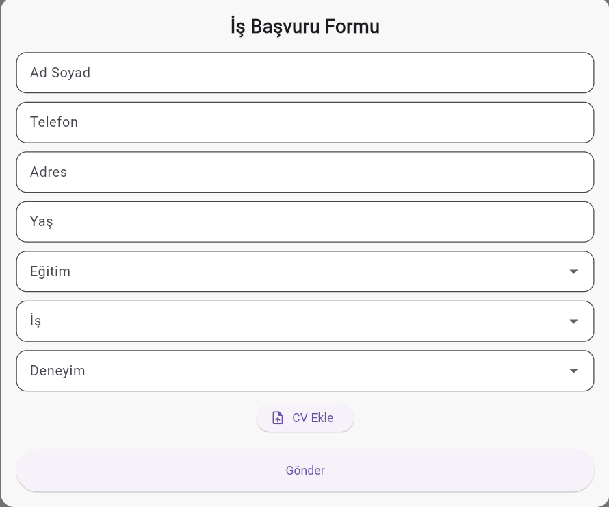

#  İş Başvuru Formu (Flutter)

Bu proje, Flutter kullanılarak geliştirilmiş modern bir **iş başvuru formu uygulamasıdır**. Kullanıcılar kişisel bilgilerini girip eğitim, iş türü ve deneyim seçerek başvuru yapabilir.

---

##  Özellikler

- Ad Soyad, Telefon, Adres ve Yaş girişi
- Eğitim seviyesi seçimi (Dropdown)
- İş pozisyonu seçimi
- Deneyim yılı seçimi
- CV yükleme butonu (simülasyon)
- Form doğrulama (validation)
- Başarılı gönderim popup mesajı
- Arka plan görselli modern UI
- Responsive ve şık tasarım

---

##  Kullanılan Teknolojiler

- Flutter
- Dart
- Material Design

---

##  Ekran Görüntüsü

  

---
